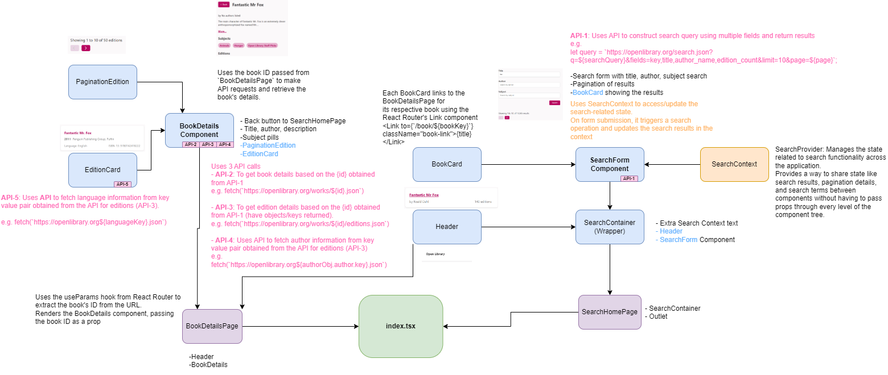
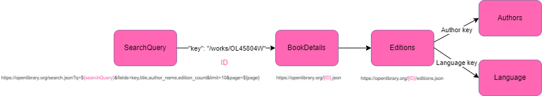

# bookfinder App

## About

The bookfinder React App is a prototype book search application using the Open Library public APIs.

Documentation for the Open Library APIs are found here: https://openlibrary.org/developers/api

Two user stories were provided as a set of cucumber scenarios with the following features:
- Book Search
- Book Details

Please see the task documentation for the full scenarios.

Some subjective decisions were made to provide the prototype based on the images and would require
clarification from the request. Some of these are detailed in the below table.

| Visual                                                                                                                                                                          |     Interpretation   of component/feature                                                                                                                     |
|---------------------------------------------------------------------------------------------------------------------------------------------------------------------------------|---------------------------------------------------------------------------------------------------------------------------------------------------------------|
| **BookDetails**                                                                                                                                                                 |                                                                                                                                                               |
| More button   on editions                                                                                                                                                       |     Display the   first 350 characters and then use more button as trigger to show the rest of   the description. Add state for toggling full description.    |
| **EditionCard**                                                                                                                                                                 |                                                                                                                                                               |
| ISBN-10 is   mostly shown but occasionally ISBN-13                                                                                                                              |     Display   isbn-10 as preference but if that’s not available then display isbn-13                                                                          |
| Some Titles   for editions look clickable in the provided image and others are not. Task   does not detail whether this should be a clickable link to another page/more   info. |     Remove any   underlines so user not confused whether they can click on the edition title   for now.                                                       |

## Overview

The App allows a user to make a search for a particular book using author, title or subject
or a combination of all 3 in a Searchfield. On clicking the 'Search' button the
book results appear as a series of individual cards, there is also pagination to split the results into 10 per page.

A user can then click on the title of the book in one of the results cards which will take them to
a page with greater details on that particular book (Title, author, description, first 3 subjects).
In addition, all the editions of that particular book appear beneath this details section as a series of individual cards.
Like with the book search results, pagination is also provided in blocks of 10 for the editions.

On the Book Details page there is a 'Back' button that allows the user to return to their recently run search
back on the initial Search page maintaining the state of the results, text searched and pagination.

## Architecture Diagram

## Architecture Description

This React app uses CSS and Typescript and is structured with index.tsx at the root. Index.tsx manages the 
routes and provides a global context for search functionality. 
The SearchHomePage and BookDetailsPage are the main pages routed from 
index.tsx. SearchHomePage integrates search-related components 
(SearchForm and BookCard), while the 
BookDetailsPage focuses on displaying detailed information 
about a specific book and its editions (BookDetails and EditionCard). 
The Header is a common component that appears across different pages. 
The SearchProvider from SearchContext allows for state management related to 
the search functionality across the components.

5 API calls are made using the native fetch API for making HTTP requests 
(part of the JavaScript/supported in most browsers).

**API calls examples**:

SearchQuery:
https://openlibrary.org/search.json?q=title:fox+author:Roald+Dahl+subject:foxes&fields=key,title,author_name,edition_count&limit=10

BookDetails:
https://openlibrary.org/works/OL45804W.json

Editions:
https://openlibrary.org/works/OL45804W/editions.json

Authors (object for authors from edition results, "authors": [{"author": {"key": "/authors/OL34184A"}):
https://openlibrary.org/authors/OL12345A.json

Language (object from editions results for language:"languages": [{"key": "/languages/eng"}]):
https://openlibrary.org/languages/eng.json

## Next Steps

Some first steps to improve the application from this initial prototype would be the following:
* Improved error handling
* Identification and management of further edge cases
* Components that could be reused:

  -EditionCard and BookCard (could pass props instead)

  -PaginationEdition as pagination functionality used in both BookDetails for Edition as well as in the SearchForm for Books
* Add framework to test React application (Jest with the React Testing Library) 
to ensure works as expected and integrate with CI/CD pipeline

## Getting Started with Create React App

This project was bootstrapped with [Create React App](https://github.com/facebook/create-react-app).

## Available Scripts

In the project directory, you can run:

### `npm start`

Runs the app in the development mode.\
Open [http://localhost:3000](http://localhost:3000) to view it in the browser.

The page will reload if you make edits.\
You will also see any lint errors in the console.

### `npm test`

Launches the test runner in the interactive watch mode.\
See the section about [running tests](https://facebook.github.io/create-react-app/docs/running-tests) for more information.

### `npm run build`

Builds the app for production to the `build` folder.\
It correctly bundles React in production mode and optimizes the build for the best performance.

The build is minified and the filenames include the hashes.\
Your app is ready to be deployed!

See the section about [deployment](https://facebook.github.io/create-react-app/docs/deployment) for more information.

### `npm run eject`

**Note: this is a one-way operation. Once you `eject`, you can’t go back!**

If you aren’t satisfied with the build tool and configuration choices, you can `eject` at any time. This command will remove the single build dependency from your project.

Instead, it will copy all the configuration files and the transitive dependencies (webpack, Babel, ESLint, etc) right into your project so you have full control over them. All of the commands except `eject` will still work, but they will point to the copied scripts so you can tweak them. At this point you’re on your own.

You don’t have to ever use `eject`. The curated feature set is suitable for small and middle deployments, and you shouldn’t feel obligated to use this feature. However we understand that this tool wouldn’t be useful if you couldn’t customize it when you are ready for it.

## Learn More

You can learn more in the [Create React App documentation](https://facebook.github.io/create-react-app/docs/getting-started).

To learn React, check out the [React documentation](https://reactjs.org/).
